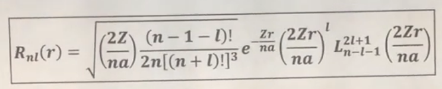
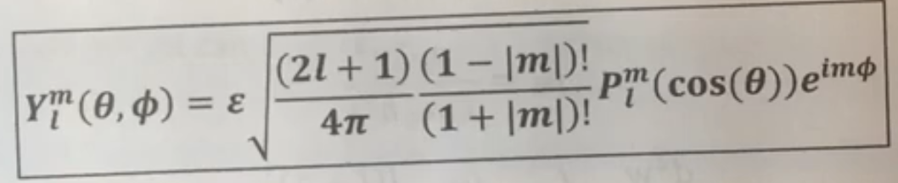
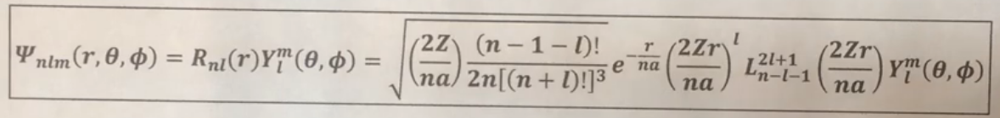

# Clouds And Computers

My final project (a hybrid quantum computing and orbitals and art video game) for my PHYS 199 CHP class.

# Attribution Information

Large portions of this project have been generated entirely using artificial intelligence, especially ChatGPT and GitHub Copilot. Other parts of this project were completed using the assistance of these AI tools, even if they were not directly generated by the tools themselves.

Much of the Blender code/modeling for the electron orbital clouds is sourced from YouTuber Least.Action's [publicly available Blender code](https://github.com/akdpsi/3dOrbitalsBlenderParticles) and is used under Creative Commons CC0 1.0 Universal License.

[The music from this game](https://pixabay.com/music/beats-echoes-of-the-void-ambient-music-323689/) has been graciously provided by AudioPapkin on Pixabay.

